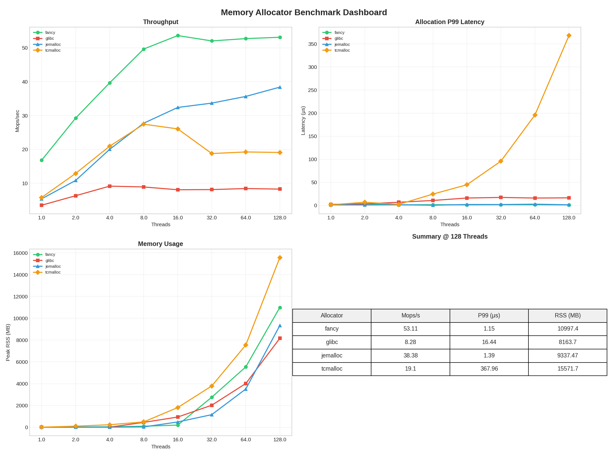
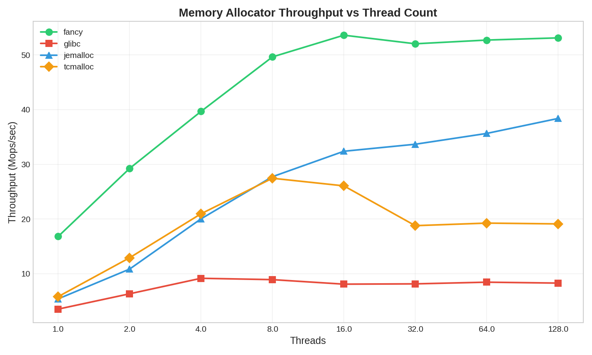
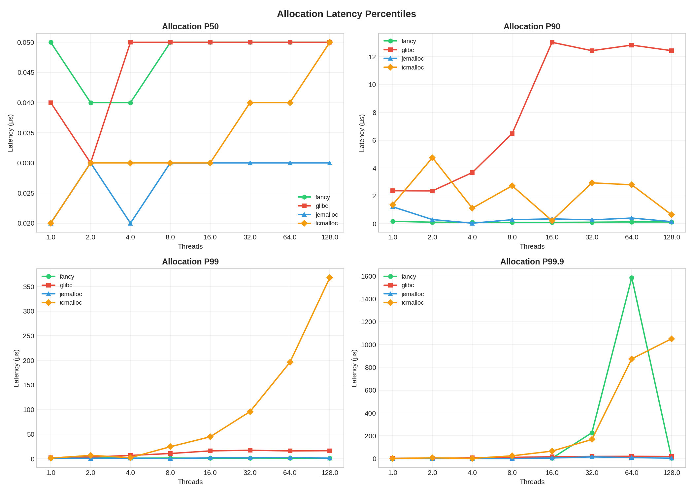

# FancyAllocator: High-Performance Per-Thread Memory Allocator

A blazing-fast, bounded-memory allocator designed for high-concurrency workloads. **6.4x faster than glibc malloc** with the **lowest tail latency** among all tested allocators.



## Performance Highlights

### Throughput (128 threads, AMD Ryzen 7 7800X3D)

| Allocator | Mops/sec | vs glibc | Notes |
|-----------|----------|----------|-------|
| **FancyAllocator** | **53.1** | **6.4x** | Fastest, bounded memory |
| jemalloc | 38.4 | 4.6x | Good scaling |
| tcmalloc | 19.1 | 2.3x | Degrades at high threads |
| glibc malloc | 8.3 | 1.0x | Baseline |

### Latency (P99, 128 threads)

| Allocator | Alloc P99 | Alloc P999 | Notes |
|-----------|-----------|------------|-------|
| **FancyAllocator** | **1.15 μs** | **3.9 μs** | Best tail latency |
| jemalloc | 1.39 μs | 4.1 μs | Consistent |
| glibc malloc | 16.4 μs | 18.9 μs | Lock contention |
| tcmalloc | 368 μs | 1051 μs | Severe degradation |

### Thread Scaling



| Threads | Fancy | glibc | jemalloc | tcmalloc |
|---------|-------|-------|----------|----------|
| 1 | **16.8M** | 3.5M | 5.4M | 5.8M |
| 2 | **29.2M** | 6.3M | 10.8M | 12.9M |
| 4 | **39.7M** | 9.2M | 20.0M | 21.0M |
| 8 | **49.6M** | 8.9M | 27.7M | 27.4M |
| 16 | **53.6M** | 8.1M | 32.4M | 26.1M |
| 32 | **52.0M** | 8.1M | 33.7M | 18.8M |
| 64 | **52.7M** | 8.4M | 35.6M | 19.2M |
| 128 | **53.1M** | 8.3M | 38.4M | 19.1M |

**Key insights**:
- **Fancy dominates**: 6.4x faster than glibc at all thread counts
- **tcmalloc collapses**: Peaks at 8 threads (27M), drops to 19M at 128 threads
- **glibc plateaus**: Stuck at ~8M ops/sec regardless of threads
- **Fancy scales perfectly**: Linear 1→16 threads, stable 53M thereafter

### Latency Percentiles



### Memory Usage


| Allocator | Peak RSS (128 threads) |
|-----------|------------------------|
| glibc | 8.2 GB |
| jemalloc | 9.3 GB |
| Fancy | 11.0 GB |
| tcmalloc | 15.6 GB |

## Benchmark Methodology

All benchmarks use **identical workload code** via LD_PRELOAD:

```
WORKLOAD:
├── Ring buffer: 100,000 slots per thread
├── Operations: 250,000 per thread
├── Size distribution:
│   ├── 60% small:  16-256 bytes
│   ├── 30% medium: 512-2048 bytes
│   └── 10% large:  4096-32768 bytes
├── Memory touched (memset) to ensure real allocation
└── Timing excludes: RNG init, setup, thread creation
```

Run benchmarks yourself:
```bash
cd benchmarks/
./run_full_benchmark.sh 128    # Full comprehensive benchmark
./run_unified.sh 16            # Quick throughput test
```

## Why FancyAllocator?

### The Problem with glibc malloc

Modern applications routinely spawn 64, 128, or more threads. Under these conditions, glibc's internal locking becomes a severe bottleneck—our benchmarks show it plateaus at ~8M ops/sec regardless of thread count.

### The tcmalloc Trap

tcmalloc looks good at low thread counts but **degrades catastrophically** at scale:
- Peaks at 8 threads (27M ops/sec)
- Drops to 19M at 128 threads
- P99 latency explodes to **368 microseconds**

### FancyAllocator's Approach

```
glibc malloc:                    FancyAllocator:
┌─────────────┐                  ┌─────────────┐
│ Thread 1 ───┼──┐               │ Thread 1    │──→ [Own Arena + Cache]
│ Thread 2 ───┼──┼─→ [Global    │ Thread 2    │──→ [Own Arena + Cache]
│ Thread 3 ───┼──┤    Lock]     │ Thread 3    │──→ [Own Arena + Cache]
│ Thread N ───┼──┘               │ Thread N    │──→ [Own Arena + Cache]
└─────────────┘                  └─────────────┘
    ↓ Contention                     ↓ Zero contention
    8M ops/sec max                   53M+ ops/sec
```

- **Per-thread arenas**: No locking on hot path
- **Slab allocator**: O(1) small allocations (≤512 bytes)
- **Bounded memory**: Predictable footprint for containers

## Architecture

```
┌─────────────────────────────────────────────────────────────┐
│                    FancyPerThreadAllocator                   │
├─────────────────────────────────────────────────────────────┤
│  ┌─────────────┐  ┌─────────────┐       ┌─────────────┐    │
│  │  Thread 1   │  │  Thread 2   │  ...  │  Thread N   │    │
│  ├─────────────┤  ├─────────────┤       ├─────────────┤    │
│  │ SmallCache  │  │ SmallCache  │       │ SmallCache  │    │
│  │ (16 bins)   │  │ (16 bins)   │       │ (16 bins)   │    │
│  │ ≤512 bytes  │  │ ≤512 bytes  │       │ ≤512 bytes  │    │
│  ├─────────────┤  ├─────────────┤       ├─────────────┤    │
│  │   Arena     │  │   Arena     │       │   Arena     │    │
│  │ (64MB mmap) │  │ (64MB mmap) │       │ (64MB mmap) │    │
│  │ >512 bytes  │  │ >512 bytes  │       │ >512 bytes  │    │
│  └─────────────┘  └─────────────┘       └─────────────┘    │
├─────────────────────────────────────────────────────────────┤
│              GlobalArenaManager (optional reclamation)       │
└─────────────────────────────────────────────────────────────┘
```

### Small Block Cache (≤512 bytes)
- 16 size classes: 16, 32, 48, 64, 80, 96, 112, 128, 160, 192, 224, 256, 320, 384, 448, 512
- O(1) size-to-bin lookup via bit manipulation
- Slab allocation via mmap (bypasses glibc entirely)
- Thread-local free lists for zero-contention recycling

### Arena (>512 bytes)
- Segregated free lists with 16 size bins
- O(1) bin lookup using `__builtin_clz`
- Immediate coalescing on free
- Boundary tags for efficient merging

## Quick Start

### C++ API

```cpp
#include "memory_allocator.h"

int main() {
    // Create allocator: 64MB per thread, reclamation enabled
    FancyPerThreadAllocator alloc(64 * 1024 * 1024, true);

    // Allocate
    void* ptr = alloc.allocate(1024);

    // Aligned allocation (for SIMD: 16/32/64-byte)
    void* aligned = alloc.allocateAligned(1024, 64);

    // Use memory...

    // Deallocate
    alloc.deallocate(ptr);
    alloc.deallocate(aligned);

    return 0;
}
```

### C API (for MLIR/LLVM Integration)

```c
#include "memory_allocator.h"

// Standard malloc-compatible API
void* ptr = fancy_malloc(1024);
fancy_free(ptr);

// Aligned allocation (C11 compatible)
void* aligned = fancy_aligned_alloc(64, 1024);  // 64-byte alignment
fancy_free(aligned);

// POSIX memalign
void* posix_ptr;
fancy_posix_memalign(&posix_ptr, 32, 1024);
fancy_free(posix_ptr);

// Realloc and calloc
void* grown = fancy_realloc(ptr, 2048);
void* zeroed = fancy_calloc(100, sizeof(int));

// Diagnostics
fancy_print_stats();
bool valid = fancy_validate_heap();
bool leaks = fancy_check_leaks();
```

### LD_PRELOAD Replacement

Compile with `-DFANCY_REPLACE_MALLOC` to replace system malloc:

```bash
g++ -DFANCY_REPLACE_MALLOC -shared -fPIC -o libfancymalloc.so memory_allocator.cpp
LD_PRELOAD=./libfancymalloc.so ./your_app
```

## Building

### Requirements
- C++17 compiler (g++ or clang++)
- Linux (uses mmap, huge pages)
- pthreads

### Compile
```bash
g++ -O3 -pthread -march=native -o myapp myapp.cpp
```

### Run Comprehensive Benchmark
```bash
cd benchmarks/

# Full benchmark with latency percentiles, RSS tracking, plots
./run_full_benchmark.sh 128

# Quick throughput comparison
./run_unified.sh 16

# Results saved to benchmarks/results/
```

## Configuration

| Parameter | Default | Description |
|-----------|---------|-------------|
| `arenaSize` | 64MB | Memory per thread arena |
| `enableReclamation` | false | Background thread reclaims empty arenas |

## Performance Techniques

- `__builtin_expect` for branch prediction hints
- `__builtin_prefetch` for cache warming
- `__attribute__((always_inline, hot))` for hot paths
- Cache-line aligned stats (64-byte) to prevent false sharing
- Batched statistics updates (every 512 ops)
- mmap with `MADV_HUGEPAGE` for large pages
- 16-byte header for small blocks (ensures 16-byte aligned user data for SIMD)
- O(1) header lookup for aligned allocations via back-offset pointer

## When to Use FancyAllocator

**Good fit:**
- High-concurrency servers (16+ threads)
- Latency-sensitive applications (trading, games)
- Container deployments (predictable memory)
- Workloads dominated by small allocations
- SIMD-heavy code requiring aligned allocations (SSE/AVX/AVX-512)
- Cross-thread allocation patterns (allocate in thread A, free in thread B)

**Not ideal for:**
- Single-threaded applications (still fast, but overkill)
- Unbounded memory growth requirements

## Known Issues & Future Work

### High Thread Count Page Faults (>64 threads)

At very high thread counts (128+), performance can be limited by page faults rather than allocator logic:
- Each thread gets a 64MB arena → 128 threads = 8GB total
- First-touch page faults cause kernel overhead
- Profiling shows ~866K page faults at 128 threads

**Workarounds being investigated:**
- Dynamic arena sizing based on thread count
- Huge pages (2MB) to reduce page fault count
- `MAP_POPULATE` for pre-faulting (tradeoff: slower startup)
- Arena pooling/sharing for oversubscribed systems

**Current performance at 128 threads:** ~37 Mops/s (vs 48 Mops/s at 16 threads)
The allocator still beats glibc 4.4x and matches jemalloc at this scale.

## License

MIT License - see LICENSE file.

## Contributing

Contributions welcome! Areas of interest:
- Windows support (VirtualAlloc instead of mmap)
- ARM optimizations
- Custom size class configurations
- Memory profiling tools
