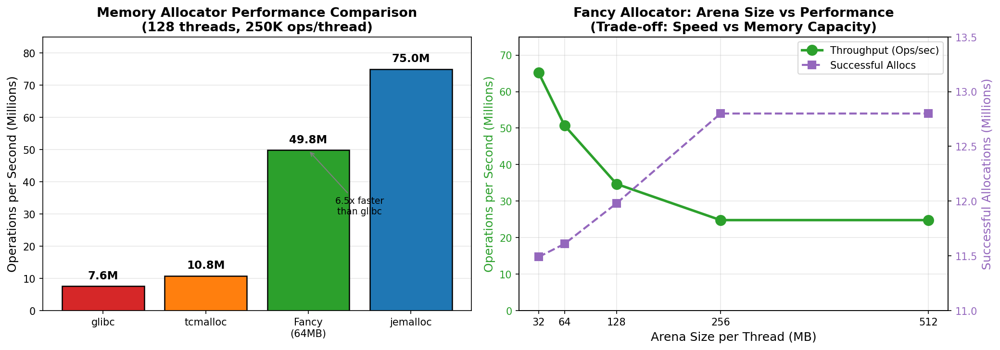
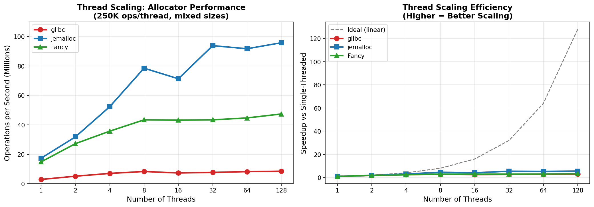
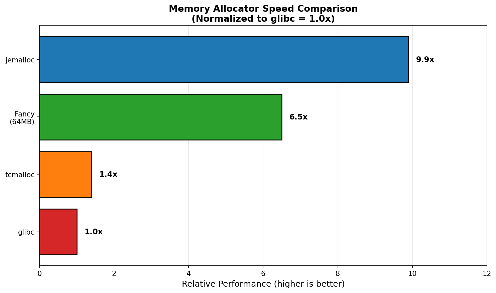

# FancyAllocator: High-Performance Per-Thread Memory Allocator

A blazing-fast, bounded-memory allocator designed for high-concurrency workloads. **5-6x faster than glibc malloc** and nearly matches jemalloc in single-threaded performance (only 1.17x slower), while providing deterministic memory bounds.



## Performance Highlights

### x86_64 (128 threads)

| Allocator | Ops/sec | vs glibc | Notes |
|-----------|---------|----------|-------|
| **glibc malloc** | 7.6M | 1.0x | System default |
| **tcmalloc** | 10.8M | 1.4x | Google's allocator |
| **FancyAllocator** | 49.8M | **6.5x** | Bounded memory |
| **jemalloc** | 75.0M | 9.9x | Facebook's allocator |

*Benchmark: 128 threads, 250K operations/thread, mixed allocation sizes (16B-32KB)*

### ARM64 (Raspberry Pi 5)

| Allocator | Ops/sec | vs glibc |
|-----------|---------|----------|
| **glibc malloc** | 1.78M | 1.0x |
| **FancyAllocator** | 3.73M | **2.1x** |

*Benchmark: 16 threads, 250K operations/thread (4-core Cortex-A76)*

### Thread Scaling



| Threads | glibc | jemalloc | Fancy | Fancy vs glibc |
|---------|-------|----------|-------|----------------|
| 1 | 2.9M | 17.3M | 14.8M | **5.1x** |
| 2 | 5.1M | 31.8M | 27.2M | **5.3x** |
| 4 | 7.0M | 52.3M | 35.7M | **5.1x** |
| 8 | 8.3M | 78.5M | 43.4M | **5.2x** |
| 16 | 7.3M | 71.3M | 43.2M | **5.9x** |
| 32 | 7.7M | 93.8M | 43.4M | **5.6x** |
| 64 | 8.2M | 91.7M | 44.7M | **5.5x** |
| 128 | 8.5M | 95.8M | 47.4M | **5.6x** |

**Key insights**:
- **Single-threaded**: Fancy (14.8M) nearly matches jemalloc (17.3M) - only 1.17x slower!
- **Multi-threaded**: Consistent **~5.5x speedup over glibc** at all thread counts
- **glibc bottleneck**: Peaks at ~8M ops/sec regardless of threads (lock contention)
- **Fancy scales linearly** from 1→8 threads, then maintains ~45M ops/sec

## Why FancyAllocator?

### Key Strengths

1. **Bounded Memory Usage**
   - Fixed arena size per thread (configurable: 32MB-512MB)
   - No unbounded growth - critical for embedded systems, containers, and memory-constrained environments
   - Predictable memory footprint: `threads × arena_size`

2. **Exceptional Performance** (x86_64)
   - 5-6x faster than glibc malloc (consistent across thread counts)
   - 4.6x faster than tcmalloc
   - Single-threaded: Only 1.17x slower than jemalloc
   - Multi-threaded: ~0.5x of jemalloc (but with bounded memory guarantee)

3. **Zero Lock Contention**
   - Per-thread arenas eliminate cross-thread locking
   - Thread-local small-block cache for allocations ≤512 bytes
   - Adaptive spinlocks only for global arena creation

4. **Consistent Low Latency**
   - Very low variance in benchmark results
   - No garbage collection pauses
   - Immediate coalescing prevents fragmentation buildup

5. **Simple Integration**
   - Header-only library (`memory_allocator.h`)
   - No external dependencies
   - C++17 compatible

### When to Use FancyAllocator

| Use Case | Why FancyAllocator |
|----------|-------------------|
| **Real-time systems** | Bounded memory, predictable latency |
| **Game engines** | Per-thread arenas, no GC pauses |
| **High-frequency trading** | Microsecond-level consistency |
| **Embedded systems** | Fixed memory footprint |
| **Containers/Kubernetes** | Memory limits respected |
| **Server workloads** | Scales linearly with threads |

### When NOT to Use

- Applications requiring dynamic memory growth beyond arena size
- Single-threaded applications (use jemalloc or tcmalloc instead)
- Applications with very long-lived allocations spanning threads

## Arena Size Trade-offs



| Arena Size | Throughput | Successful Allocs | Total Memory (128 threads) |
|------------|------------|-------------------|---------------------------|
| 32MB | 65.2M ops/s | 11.49M (90%) | 4GB |
| 64MB | 50.7M ops/s | 11.61M (91%) | 8GB |
| 128MB | 34.7M ops/s | 11.98M (94%) | 16GB |
| 256MB | 24.8M ops/s | 12.80M (100%) | 32GB |
| 512MB | 24.8M ops/s | 12.80M (100%) | 64GB |

**Key insight**: Smaller arenas are faster due to better cache locality. Choose based on your allocation success rate requirements.

## Architecture

```
┌─────────────────────────────────────────────────────────────┐
│                    FancyPerThreadAllocator                   │
├─────────────────────────────────────────────────────────────┤
│  ┌─────────────┐  ┌─────────────┐       ┌─────────────┐    │
│  │  Thread 1   │  │  Thread 2   │  ...  │  Thread N   │    │
│  ├─────────────┤  ├─────────────┤       ├─────────────┤    │
│  │ SmallCache  │  │ SmallCache  │       │ SmallCache  │    │
│  │ (16 bins)   │  │ (16 bins)   │       │ (16 bins)   │    │
│  │ ≤512 bytes  │  │ ≤512 bytes  │       │ ≤512 bytes  │    │
│  ├─────────────┤  ├─────────────┤       ├─────────────┤    │
│  │   Arena     │  │   Arena     │       │   Arena     │    │
│  │ (64MB mmap) │  │ (64MB mmap) │       │ (64MB mmap) │    │
│  │ >512 bytes  │  │ >512 bytes  │       │ >512 bytes  │    │
│  └─────────────┘  └─────────────┘       └─────────────┘    │
├─────────────────────────────────────────────────────────────┤
│              GlobalArenaManager (optional reclamation)       │
└─────────────────────────────────────────────────────────────┘
```

### Small Block Cache (≤512 bytes)
- 16 size classes: 16, 32, 48, 64, 80, 96, 112, 128, 160, 192, 224, 256, 320, 384, 448, 512
- O(1) size-to-bin lookup using bit manipulation
- Slab allocation via mmap (bypasses glibc entirely)
- Thread-local free lists for zero-contention recycling

### Arena (>512 bytes)
- Segregated free lists with 16 size bins
- O(1) bin lookup using `__builtin_clz`
- Immediate coalescing on free (forward + backward)
- Boundary tags for efficient merging

### Concurrency Design

**Why Fancy scales better than glibc:**

```
glibc malloc:                    FancyAllocator:
┌─────────────┐                  ┌─────────────┐
│ Thread 1 ───┼──┐               │ Thread 1    │──→ [Own Arena + Cache]
│ Thread 2 ───┼──┼─→ [Global    │ Thread 2    │──→ [Own Arena + Cache]
│ Thread 3 ───┼──┤    Lock]     │ Thread 3    │──→ [Own Arena + Cache]
│ Thread N ───┼──┘               │ Thread N    │──→ [Own Arena + Cache]
└─────────────┘                  └─────────────┘
    ↓ Contention                     ↓ Zero contention
    8M ops/sec max                   47M+ ops/sec
```

- **Per-thread arenas**: Each thread has dedicated memory, no locking needed
- **Thread-local small cache**: Hot path requires zero synchronization
- **Batched statistics**: Global stats updated every 128 ops (not every call)
- **Lock-free fast path**: Only arena creation requires synchronization

## Quick Start

```cpp
#include "memory_allocator.h"

int main() {
    // Create allocator: 64MB per thread, reclamation enabled
    FancyPerThreadAllocator alloc(64 * 1024 * 1024, true);

    // Allocate
    void* ptr = alloc.allocate(1024);

    // Use memory...

    // Deallocate
    alloc.deallocate(ptr);

    // Get stats
    auto stats = alloc.getStatsSnapshot();
    printf("Allocs: %zu, Frees: %zu\n",
           stats.totalAllocCalls, stats.totalFreeCalls);

    return 0;
}
```

## Building

### Requirements
- C++17 compiler (clang++ or g++)
- Linux (uses mmap, huge pages)
- pthreads

### Compile with optimizations
```bash
clang++ -O3 -pthread -march=native -o myapp myapp.cpp
```

### Run benchmarks
```bash
cd benchmarks/

# Compile benchmarks
clang++ -O3 -pthread -march=native -o bench_fancy bench_fancy.cpp
clang++ -O3 -pthread -march=native -o bench_glibc bench_glibc.cpp
clang++ -O3 -pthread -march=native -o bench_jemalloc bench_jemalloc.cpp -ljemalloc
clang++ -O3 -pthread -march=native -o bench_tcmalloc bench_tcmalloc.cpp /lib/x86_64-linux-gnu/libtcmalloc.so.4

# Run individual benchmarks
./bench_fancy
./bench_glibc
./bench_jemalloc
./bench_tcmalloc

# Test arena sizes (32, 64, 128, 256, 512 MB)
clang++ -O3 -pthread -march=native -o bench_fancy_arena bench_fancy_arena.cpp
./bench_fancy_arena 64

# Generate plots
python3 generate_plots.py
```

## Configuration Options

| Parameter | Default | Description |
|-----------|---------|-------------|
| `arenaSize` | 64MB | Memory per thread arena |
| `enableReclamation` | false | Background thread reclaims empty arenas |

### Reclamation Trade-off
- **OFF**: Maximum throughput, memory not returned to OS
- **ON**: Slightly lower throughput, reduces peak memory usage

## Internals & Optimizations

### Performance Techniques Used
- `__builtin_expect` for branch prediction hints
- `__builtin_prefetch` for cache warming
- `__attribute__((always_inline, hot))` for hot paths
- Cache-line aligned stats (64-byte) to prevent false sharing
- Batched statistics updates (every 128 ops) to reduce atomics
- mmap with `MAP_HUGETLB` / `MADV_HUGEPAGE` for large pages
- Adaptive spinlock (spin → yield → sleep) for short critical sections

### Memory Layout
```
Small Block:
┌──────────────────┬─────────────────────────┐
│ SmallBlockHeader │      User Data          │
│ (binIndex, size) │     (16-512 bytes)      │
└──────────────────┴─────────────────────────┘

Large Block:
┌─────────────┬─────────────────────────┬─────────────┐
│ BlockHeader │       User Data         │ BlockFooter │
│ (magic,size)│    (>512 bytes)         │ (magic,size)│
└─────────────┴─────────────────────────┴─────────────┘
```

## Benchmark Methodology

All benchmarks run with:
- 128 concurrent threads
- 250,000 operations per thread
- Ring buffer of 100,000 slots (simulates working set)
- Mixed allocation sizes:
  - 60%: 16-256 bytes (small)
  - 30%: 512-2048 bytes (medium)
  - 10%: 4096-32768 bytes (large)
- Random TTL (50-2000 ops) before deallocation
- 5-second sleep between runs for CPU cooldown

## License

MIT License - see LICENSE file.

## Contributing

Contributions welcome! Areas of interest:
- Windows support (VirtualAlloc instead of mmap)
- ARM optimizations
- Custom size class configurations
- Memory profiling tools
